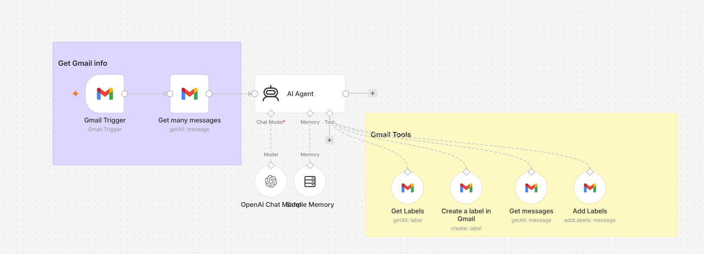

# AI Gmail Classifier using n8n

An AI-powered Gmail classification workflow built with n8n.

## What it does

The workflow reads incoming Gmail messages and uses an AI Agent
to understand and classify the emails into meaningful categories.

For example:

- Jobs
- Investments
- Personal
- Important
- Other

The classified emails can then be assigned Gmail labels automatically.

## Workflow

## Technologies

- n8n
- Gmail
- OpenAI
- AI Agent
- Gmail Labels

## Features

- Automatic email classification
- AI-based understanding of email content
- Gmail label creation
- Automatic organization of emails
- Can be extended with additional categories

## Example

Email:
"Investment opportunity with..."

AI classification:
`Investments`

Gmail label:
`Investments`

Email:
"Data Engineer position at..."

AI classification:
`Jobs`

Gmail label:
`Jobs`